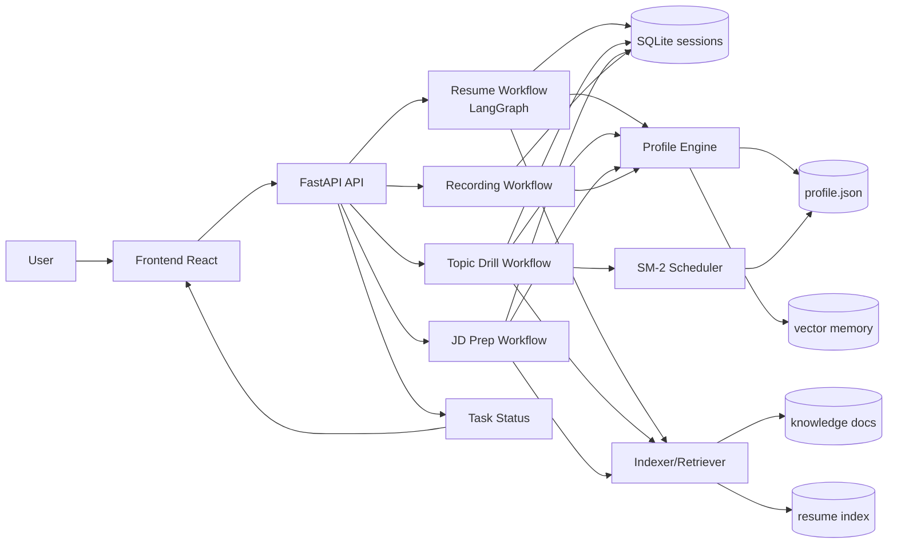
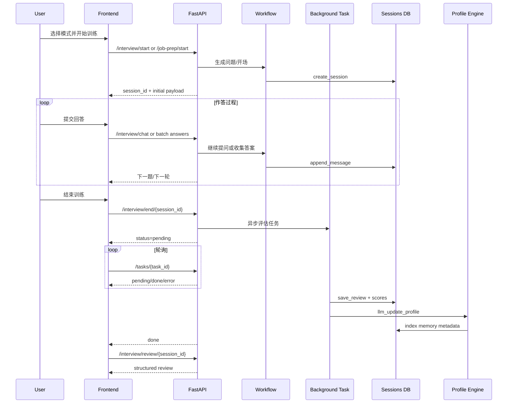
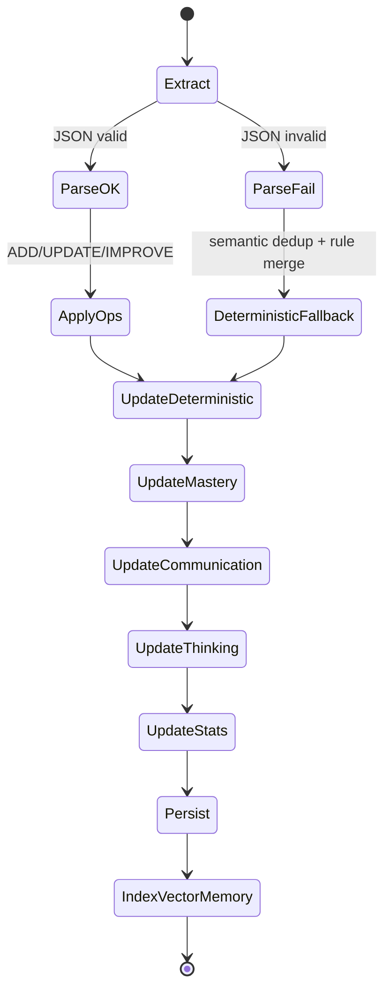

# TechSpar 项目说明与方法论

## 1. 文档目的

本文档面向两类读者：

- 产品或运营：理解 TechSpar 为什么能做到“越练越准”
- 开发者：理解系统如何从一次训练生成结构化反馈，并持续更新用户画像

目标不是重复 README，而是提炼可迁移的方法论：如何把一个 AI 问答产品升级为“长期成长系统”。

---

## 2. 系统定位

TechSpar 的核心不是“生成题目”，而是构建一个持续优化的训练闭环。

系统定位可概括为：

- 持续记忆：记住用户历史薄弱点、强项、表达与思维模式
- 个性化训练：下一轮训练由历史表现驱动，而不是从零开始
- 可量化改进：每轮输出分数、弱项、改进建议与趋势
- 复习调度：通过间隔重复把“知道薄弱点”变成“真正补上薄弱点”

---

## 3. 总体架构

三层架构：

- 体验层：React 前端，负责训练流程、任务轮询、复盘展示
- 编排层：FastAPI + 多工作流（简历面试、专项训练、JD 备面、录音复盘）
- 记忆层：SQLite 会话库 + 用户画像文件 + 向量检索 + 间隔重复状态

关键代码位置：

- 后端入口：backend/main.py
- 专项训练：backend/graphs/topic_drill.py
- 简历面试图：backend/graphs/resume_interview.py
- JD 备面：backend/graphs/job_prep.py
- 复盘生成：backend/graphs/review.py
- 画像系统：backend/memory.py
- 间隔复习：backend/spaced_repetition.py
- 会话存储：backend/storage/sessions.py
- 检索索引：backend/indexer.py
- 图谱构建：backend/graph.py

---

## 4. 端到端核心工作流程

### 4.1 统一主链路

1. 用户选择训练模式并发起会话
2. 后端创建 session，加载上下文（简历、知识库、画像）
3. 用户作答（对话式或批量式）
4. 结束会话后触发异步评估任务
5. 生成结构化复盘并落库
6. 更新长期画像与复习调度状态
7. 下一轮训练读取画像，调整选题与难度

这形成了一个最小闭环：

训练 -> 评估 -> 画像更新 -> 再训练

### 4.2 各模式差异

简历模拟面试（Resume）

- 通过 LangGraph 分阶段推进：开场、自我介绍、技术、项目深挖、反问
- 对话中可插入隐式评估信号（phase + score + should_advance）
- 结束后统一生成复盘，并做画像提取更新

专项训练（Topic Drill）

- 一次性生成整套题（默认 10 题）
- 基于知识库检索 + 历史薄弱点 + 到期复习点进行出题
- 批量评估所有答案，生成逐题复盘并更新掌握度

JD 定向备面（Job Prep）

- 先做 JD 预分析（岗位核心要求、风险点、匹配度）
- 再生成岗位导向问题并评估“招聘标准下的表现”
- 输出岗位匹配视角的复盘（高风险追问点、面前补强优先级）

录音复盘（Recording）

- 音频转写后走结构化评估
- 支持双人面试记录与单人复盘两种模式
- 结果同样进入统一画像系统

---

## 5. 方法论提炼

### 5.1 方法论一：状态化训练，而非无状态问答

问题：普通 AI 问答每次都像第一次见用户，无法积累。

TechSpar 方案：

- 会话数据持久化（问题、回答、评分、复盘）
- 画像持续更新（弱项、强项、掌握度、表达风格）
- 下次训练显式使用历史画像

可迁移启发：

- 任何“成长型 AI 产品”都应把用户交互沉淀为可计算状态

### 5.2 方法论二：Extract -> Update 两阶段记忆更新

在 backend/memory.py 中采用两阶段策略：

1. Extract：从本轮对话提取结构化洞察（弱项、强项、维度分、总结）
2. Update：将新洞察与历史画像融合，而不是盲目追加

融合机制是“LLM 决策 + 确定性回退”双保险：

- 正常路径：LLM 产出 ADD/UPDATE/NOOP/IMPROVE 操作
- 回退路径：若解析失败，使用向量相似度去重和规则更新

可迁移启发：

- 不要把 LLM 输出当作最终存储；应当把 LLM 当作“建议器”，由系统执行可审计更新

### 5.3 方法论三：检索增强用于“出题与评估”双侧

RAG 不只用于回答问题，还用于：

- 出题前检索：从知识库取核心内容，确保题目贴近真实知识结构
- 评估时检索：为每题提供参考上下文，提升评分一致性和可解释性
- 画像检索：召回历史洞察，增强个性化连续性

可迁移启发：

- 在训练系统里，检索应覆盖“生成端 + 评估端 + 记忆端”三处

### 5.4 方法论四：掌握度是动态融合值，不是静态分数

专项训练里，单轮掌握度先由每题贡献计算，再与历史融合：

- 单题贡献：difficulty/5 * score/10
- 单轮得分：贡献平均后映射到 0-100

画像融合使用加权更新：

$$
merged = old \times (1-w) + new \times w
$$

其中：

$$
w = \max(min\_weight, \frac{1}{n+1}) \times coverage
$$

- n 为历史评估次数
- coverage 表示本轮答题覆盖度

可迁移启发：

- 早期快速收敛，后期保持稳定；低覆盖会话应降低权重

### 5.5 方法论五：用 SM-2 管理“薄弱点复习节奏”

在 backend/spaced_repetition.py 中：

- 每个弱项维护 interval_days、ease_factor、repetitions、next_review
- 分数 0-10 映射为 SM-2 quality 0-5
- 通过下一次复习时间驱动出题优先级

这让系统从“发现问题”升级为“推动修复问题”。

可迁移启发：

- 学习型产品必须把反馈转为行动计划，否则无法形成行为改变

### 5.6 方法论六：异步评估解耦实时体验与重计算任务

设计策略：

- 训练结束立即返回 pending
- 后台执行评估、复盘、画像更新
- 前端轮询 task 状态并异步通知用户

收益：

- 保持交互流畅
- 允许更复杂的评估逻辑和更长上下文

可迁移启发：

- 所有高延迟 AI 任务都应通过任务状态机解耦前后端

---

## 6. 数据与状态模型

### 6.1 Session（短期状态）

存储在 SQLite（sessions 表），典型字段：

- session_id, mode, topic
- questions, transcript, scores
- weak_points, overall, review
- created_at, updated_at, user_id

职责：完整记录一次训练从开始到复盘的证据链。

### 6.2 Profile（长期状态）

按用户存储在 profile.json，典型结构：

- topic_mastery：各主题掌握度与备注
- weak_points / strong_points：包含出现次数、改善状态、历史轨迹
- communication / thinking_patterns：表达与思维特征
- stats：会话量、平均分、历史分布

职责：跨会话建模用户能力变化。

### 6.3 Vector Memory（语义状态）

职责：

- 对历史洞察做语义召回
- 支撑“相似弱项去重”和“历史案例重用”

这层是 Profile 的语义索引，不替代 Profile 本体。

---

## 7. 工程策略与可维护性

### 7.1 用户隔离

- 会话、画像、知识库均按 user_id 隔离
- API 层统一基于鉴权用户读取与写入

### 7.2 缓存与失效

- 向量索引有内存缓存与持久化缓存
- 知识库或简历变更后显式失效缓存

### 7.3 可解释性优先

- 逐题评分 + 具体建议 + 弱项归因
- 不是单一总分，而是可追溯维度结构

### 7.4 回退机制

- LLM JSON 解析失败时，采用规则回退而不是直接失败
- 保障系统可用性和结果连续性

---

## 8. 可复用落地模板

如果要把该方法论迁移到其他训练场景（销售、写作、语言学习），可复用如下模板：

1. 定义短期状态：一次训练的输入、过程、输出、评分
2. 定义长期状态：能力维度、弱项清单、进步轨迹
3. 定义更新协议：Extract -> Update，且必须有回退
4. 引入复习机制：将弱项转化为“下一次任务优先级”
5. 建立异步任务链：评估、总结、画像更新解耦
6. 形成闭环指标：训练频次、覆盖率、弱项改善率、维度趋势

---

## 9. 本项目的核心竞争力总结

TechSpar 的核心优势不在“模型多强”，而在“系统方法正确”：

- 从单轮问答升级到长期能力建模
- 从一次性评分升级到持续策略调度
- 从主观反馈升级到结构化可追踪改进

换句话说，TechSpar 的价值来自方法论工程化：

让每次训练都改变下一次训练。

---

## 10. 可视化架构与时序（Mermaid）

### 10.1 系统架构图

### 10.2 训练闭环时序图

### 10.3 画像更新状态机

---

## 11. 关键指标体系（建议落地）

为了让“方法论是否有效”可量化，建议追踪以下指标。

### 11.1 学习效果指标

- 弱项改善率：已标记 improved 的弱项数 / 总弱项数
- 复习兑现率：到期复习点中被实际覆盖的比例
- 掌握度增长斜率：topic_mastery 在 7 天或 30 天窗口内的变化速率
- 迁移能力指标：跨主题维度分提升（如 problem_solving）

### 11.2 系统质量指标

- 评估解析成功率：LLM 评估 JSON 解析成功次数 / 总评估次数
- 回退触发率：deterministic fallback 触发次数 / 总更新次数
- 异步任务完成率：done / (done + error)
- 平均评估时延：从 /end 到 task=done 的耗时中位数

### 11.3 体验指标

- 会话完成率：开始训练后进入 end 的比例
- 复盘打开率：done 后访问 review 的比例
- 次日回访率：次日再次开始训练的用户比例
- 模式渗透率：resume / drill / jd / recording 的使用占比

---

## 12. 风险与防护策略

### 12.1 解析失败与数据污染

风险：LLM 返回非结构化内容导致画像污染。

防护：

- 严格 JSON 解析
- 失败时回退到确定性策略
- 强制 canonical topic 过滤

### 12.2 过度拟合历史弱项

风险：持续只问旧弱项，抑制能力外延。

防护：

- 出题策略中设置探索比例
- 限制连续命中同一弱项次数
- 定期注入跨主题迁移题

### 12.3 评分漂移

风险：模型版本变化导致分数不可比。

防护：

- 保留评分版本号
- 增加锚点题做基线校准
- 趋势展示优先相对变化而非绝对值

### 12.4 异步任务失败不可见

风险：用户只看到 pending，不知道失败原因。

防护：

- tasks 接口返回 error 类型与可读信息
- 前端通知提供重试入口
- 后台记录错误分布做 SLO 追踪

---

## 13. 实施与迭代清单（90 天）

### Phase 1（第 1-2 周）基础可观测

1. 统一埋点：start/chat/end/task/review
2. 增加方法论指标看板（完成率、时延、回退率）
3. 引入评分版本字段

### Phase 2（第 3-6 周）训练策略优化

1. 弱项复习与探索题比例动态调参
2. 高频追问模板库与反事实评估
3. 主题掌握度趋势可视化

### Phase 3（第 7-12 周）稳态与扩展

1. 引入自动 A/B 测试（不同提问策略）
2. 加入用户分层策略（新手/熟练）
3. 复盘报告结构化导出（面试周报）

---

## 14. 一页方法论复述（给团队宣讲）

TechSpar 的方法论可压缩为 4 句话：

1. 把每次训练变成可计算状态，而不是聊天记录。
2. 用 Extract -> Update 保证记忆“会演化、可回退、可审计”。
3. 把评估结果转成复习调度，形成行为层闭环。
4. 用异步任务把复杂评估留给后台，把流畅交互留给用户。

当这四件事同时成立，系统就不是“会回答问题”，而是“会帮助人成长”。
