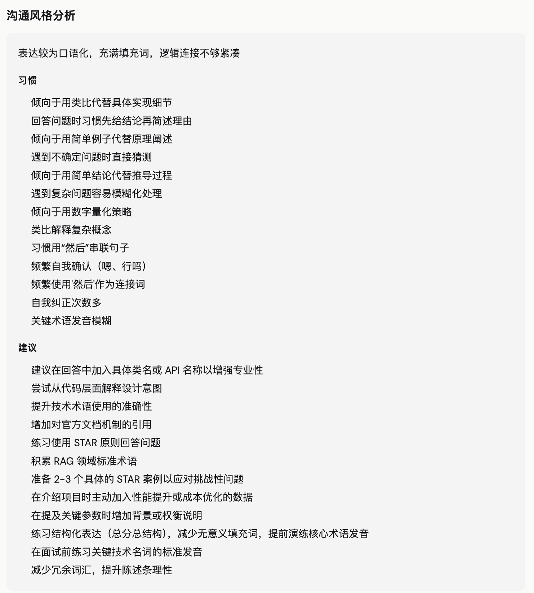

<div align="center">


[](https://fastapi.tiangolo.com/)
[](https://react.dev/)
[](https://langchain.com/)
[](https://www.docker.com/)
[](LICENSE)

**An AI interview coach that learns you — the more you practice, the better it knows your weaknesses.**

[Demo](https://aari.top/) · [快速开始](#快速开始) · [English](README.en.md)

</div>

---

## 核心功能

- **持久记忆** - 基于 Mem0 架构的用户画像系统，每次训练后自动提取薄弱点、强项、思维模式，持续演进
- **个性化出题** - 融合全局画像、领域掌握度、知识库检索三层上下文，每道题都有针对性
- **智能评估** - 逐题评分 + 薄弱点提取 + 改进建议，确定性掌握度算法量化能力水平
- **间隔重复** - SM-2 算法为每个薄弱点维护复习调度，到期知识点优先出题
- **知识库管理** - 按领域维护核心知识文档和高频题库，支持 Markdown 编辑，RAG 检索提供出题依据
- **简历模拟面试** - AI 读取简历，基于 LangGraph 状态机驱动完整面试流程（自我介绍 → 技术 → 项目深挖 → 反问）
- **专项强化训练** - 选择领域集中刷题，AI 根据画像动态调整难度，精准定位薄弱点
- **录音复盘** - 上传面试录音或粘贴文字，AI 自动转写分析，结构化 Q&A 逐题评分
- **移动端适配** - 响应式布局，移动端自动切换为顶栏 + 汉堡菜单，随时随地刷题
- **多用户隔离** - JWT 认证，数据按用户完全隔离，可配置是否开放注册

## Demo

Try TechSpar online: **[https://aari.top/](https://aari.top/)**

| Email | Password |
|-------|----------|
| admin@techspar.local | admin123 |

## Overview

传统面试工具是无状态的——每次练习都从零开始。TechSpar 构建了**持久化的候选人画像系统**：每次训练后自动提取薄弱点、评估掌握度、记录思维模式。下一次出题时，AI 面试官基于画像精准命中短板。

<p align="center">
  
</p>

<p align="center">
  
</p>

<p align="center">
  
</p>

<p align="center">
  
</p>

<p align="center">
  
</p>


## Tech Stack

| Component | Technology |
|-----------|------------|
| Backend | FastAPI, LangChain, LangGraph, LlamaIndex |
| Frontend | React 19, React Router v7, Vite, Tailwind CSS v4 |
| Storage | SQLite, bge-m3 embeddings |
| Auth | JWT, bcrypt |
| LLM | Any OpenAI-compatible API |

## 快速开始

### 1. 环境配置

```bash
cp .env.example .env
```

编辑 `.env`：

```env
# LLM（支持任何 OpenAI 兼容接口）
API_BASE=https://your-llm-api-base/v1
API_KEY=sk-your-api-key
MODEL=your-model-name

# 嵌入模型（留空则使用本地 bge-m3）
EMBEDDING_API_BASE=
EMBEDDING_API_KEY=
EMBEDDING_MODEL=BAAI/bge-m3

# 阿里云 DashScope ASR（录音转写，录音复盘功能需要）
DASHSCOPE_API_KEY=

# 七牛云 OSS（录音上传到 OSS 后供 DashScope 转写）
QINIU_ACCESS_KEY=
QINIU_SECRET_KEY=
QINIU_BUCKET=
QINIU_DOMAIN=

# 认证
JWT_SECRET=change-me-in-production
DEFAULT_EMAIL=admin@techspar.local
DEFAULT_PASSWORD=admin123
DEFAULT_NAME=Admin
ALLOW_REGISTRATION=false
```

### 2a. Docker 部署（推荐）

```bash
docker compose up --build
```

访问 `http://localhost`。

### 2b. 手动启动

```bash
# 后端
pip install -r requirements.txt
uvicorn backend.main:app --reload --port 8000

# 前端
cd frontend && npm install && npm run dev
```

访问 `http://localhost:5173`。

### 3. 旧版迁移

从无认证旧版升级：

```bash
python -m backend.migrate
```

## Project Structure

```
TechSpar/
├── backend/
│   ├── main.py                 # FastAPI, 40+ API routes
│   ├── auth.py                 # JWT auth, user management
│   ├── memory.py               # Profile engine (Mem0-style)
│   ├── vector_memory.py        # Vector memory (SQLite + bge-m3)
│   ├── indexer.py              # Knowledge indexing (LlamaIndex)
│   ├── spaced_repetition.py    # SM-2 scheduler
│   ├── migrate.py              # Database migration
│   ├── graphs/
│   │   ├── resume_interview.py # Resume interview (LangGraph)
│   │   └── topic_drill.py      # Topic drill & evaluation
│   ├── prompts/                # System prompts
│   └── storage/sessions.py     # Session persistence (SQLite)
├── frontend/src/
│   ├── App.jsx                 # Routing + auth guards
│   ├── contexts/AuthContext.jsx
│   ├── components/Sidebar.jsx
│   ├── pages/                  # Landing, Login, Home, Profile, etc.
│   └── api/interview.js        # API client (authFetch)
├── data/users/{user_id}/       # Per-user isolated data
│   ├── profile/profile.json
│   ├── resume/
│   ├── knowledge/
│   └── topics.json
├── docker-compose.yml
└── .env.example
```

## License

MIT

---

<div align="center">

**If you find this project useful, please give it a star!**

</div>
