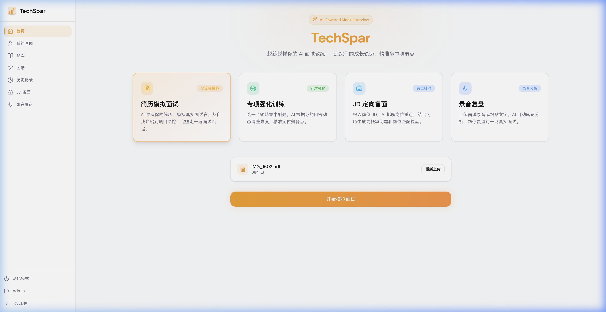
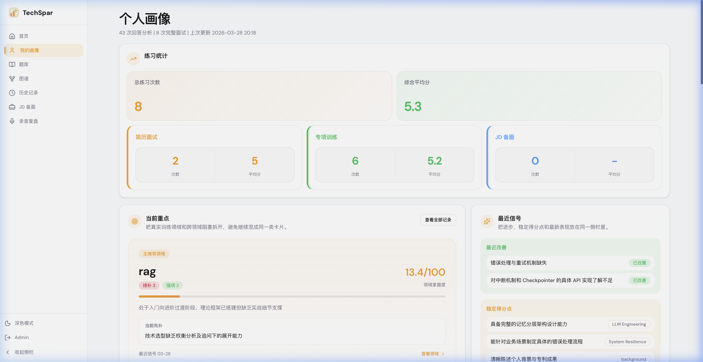

# 新手上手

本文默认你已经可以登录系统。如果项目还没跑起来，先看 [部署说明](deployment.md)。

### 第一次使用，建议按这个顺序玩

1. **先在首页做一场简历模拟面试**

   

   首页默认就是最适合新手的入口。上传一份 PDF 简历，直接开始第一轮模拟，先让系统建立你的第一批训练数据。

2. **打完第一场后，先看复盘，不要急着继续下一场**

   重点看三样东西：
   - 整体评价和平均分
   - 每道题的点评、改进建议
   - 你到底卡在“不会”“答不深”还是“表达不清”

3. **再去“我的画像”和“历史记录”看长期信号**

   “我的画像”不是让你手动填写资料的地方，它会根据你完成过的训练自动沉淀结果；“历史记录”更适合横向对比最近几轮练习。

4. **如果已经知道自己的薄弱领域，再去“题库”补内容**

   题库页不是单独上传一个“知识库项目”，而是按训练领域维护资料。你可以先建一个领域，再补核心知识点和高频题目。

5. **然后回首页做“专项强化训练”**

   这一步适合你已经知道自己要补什么，比如 “MySQL 索引”“React 性能优化”“操作系统并发模型”。不要一开始就练得太泛。

6. **面试前一天，再用 “JD 定向备面”**

   把真实岗位 JD 贴进去，先做岗位拆解，再开始训练。这个模式更适合临近真实面试时做针对性冲刺。

7. **有真实录音或转写稿时，再用“录音复盘”**

   录音复盘适合真实面试后的复盘，不是第一次体验项目的首选入口。

### 四种模式怎么选

* **简历模拟面试**：你想先知道自己项目经历会被怎么追问。
* **专项强化训练**：你已经知道薄弱主题，想集中补一个点。
* **JD 定向备面**：你手上有明确岗位 JD，想做定向冲刺。
* **录音复盘**：你已经有一段录音或逐字稿，想做事后分析。

### 新手最容易走偏的地方

* 不要先去找“个人资料配置页”。当前系统的重点是先训练，再生成画像。
* 不要一上来就堆很多领域。先把一个主题练明白，再扩展。
* 不要只盯着分数。分数是结果，逐题点评和薄弱点才是下一轮训练的输入。
* 浏览器麦克风权限不是强制项。大多数输入框都可以直接打字回答；你想用语音时再开麦即可。
