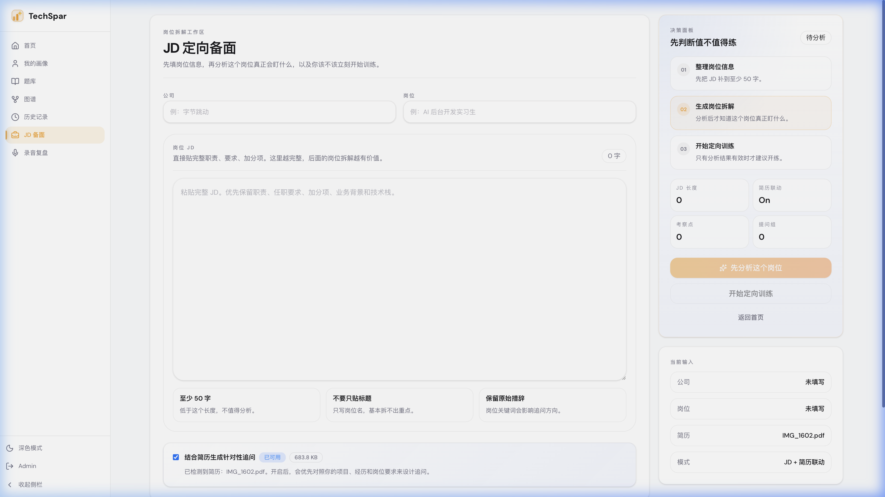

# JD 定向备面

这个模式不是“直接开始一轮面试”，而是**先拆 JD，再开始训练**。

### 适合什么时候用

* 你手上已经有明确岗位 JD。
* 你准备的不是泛化面试，而是某家公司、某个岗位。
* 你想提前判断这个岗位到底更看重什么。

### 操作流程

1. 进入左侧导航的 **JD 备面**。
2. 填公司和岗位名称，方便后续复盘更清楚。
3. 粘贴完整 JD，尽量保留职责、任职要求、加分项和技术栈。
4. 点击分析，先拿到岗位拆解结果。
5. 如果系统已经检测到你上传过简历，可以选择是否联动简历一起分析。
6. 确认分析结果后，再开始训练。

### 你会得到什么

* 岗位最看重的能力点
* 面试前最该补的方向
* 高概率追问方向
* 如果联动简历，还会看到“JD 和你的经历是否对位”的判断

### 使用建议

* 不要只贴一个岗位标题，至少把 JD 正文贴完整。
* 如果你改了 JD 内容，最好重新分析，不要直接沿用旧结果。
* 这个模式适合临近真实面试时使用，不是替代简历模拟或专项训练的基础模式。
