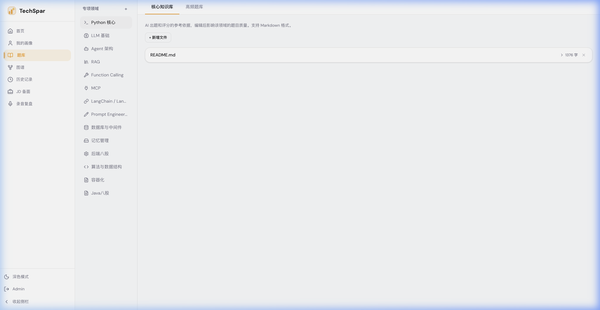
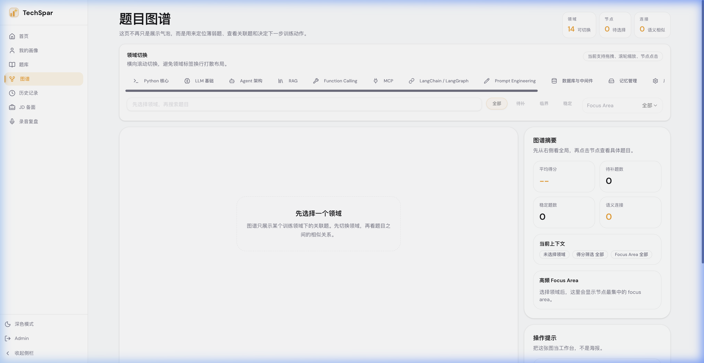

# 题库与知识库

当前产品里的“题库”是按**训练领域**组织的，不是单独维护一套外部知识库后台。

### 先理解当前模型

进入左侧导航的 **题库** 后，你维护的是某个领域下的两类内容：

* **核心知识库**：Markdown 形式的核心知识点，影响该领域的出题和评分参考。
* **高频题库**：你自己整理的高频问题、易错点、面试清单。

### 正确的使用方式

1. 在 **题库** 页面先新增一个训练领域。
2. 进入该领域后，先补 **核心知识库**。
3. 如果暂时没内容，可以直接点击 **AI 生成基础内容**，先得到一份 `README.md`。
4. 再按需要新增更多 `.md` 文件，把重点拆成更细的主题。
5. 在 **高频题库** 标签页里补充常考题、易错点和速记清单。
6. 完成后回到首页，选择 **专项强化训练**，并选中这个领域开始练。

### 当前支持什么，不支持什么

* 当前页面重点支持 **Markdown 文本编辑**。
* 核心知识文件需要是 `.md`。
* 如果你手里是 PDF、TXT 或旧题库资料，建议先提炼要点，再整理进 Markdown 文件。
* 当前没有“上传后等待激活状态”“勾选绑定知识库”这类流程。

### 推荐写法

* `README.md`：写这个领域的总览、核心概念、常见陷阱。
* 拆分文件：按子主题拆，例如 `索引.md`、`事务.md`、`锁.md`。
* 高频题库：写成短问题列表、判断点、答题 checklist，方便训练前快速扫一遍。

题库不是越大越好。对训练效果更重要的是：内容聚焦、术语统一、问题和答案边界清晰。
