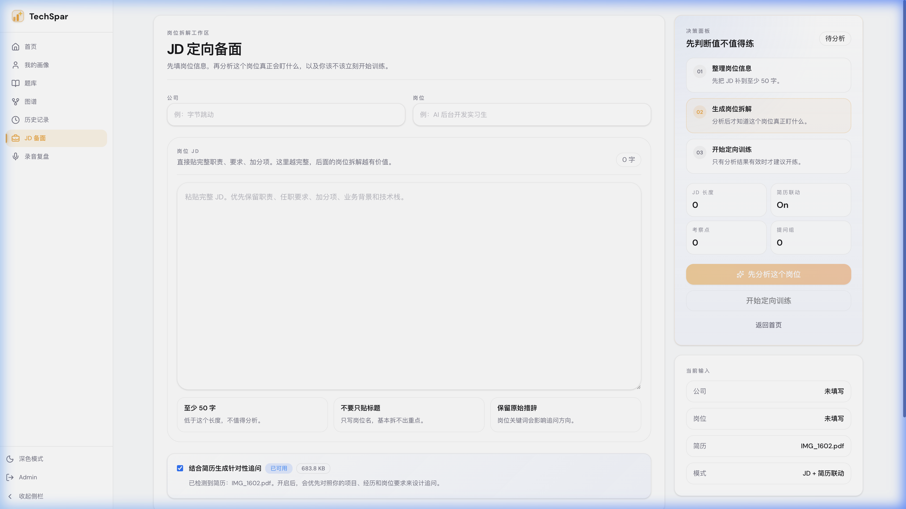

# 录音复盘

录音复盘是一个独立工作区，用来分析**真实面试录音或已有逐字稿**，不是去历史记录里回放旧音频。

### 先分清两种模式

* **双人对话**：录音里同时有面试官和你，系统会尽量还原问答结构。
* **单人录音**：只有你自己，比如自我介绍演练、复盘独白、技术表达练习。

### 正确流程

1. 进入左侧导航的 **录音复盘**。
2. 选择 **双人对话** 或 **单人录音**。
3. 公司、岗位可以填，也可以不填；填了有助于结果更聚焦。
4. 选择输入方式：
   - 上传录音
   - 直接粘贴转写文本
5. 如果你上传的是录音，先执行转写；拿到文本后再开始分析。
6. 提交后系统会异步生成复盘，完成后可以从通知或历史记录进入结果页。

### 如果录音转写用不了

上传录音转写依赖额外的语音服务配置。如果你没有配置相关环境变量，最稳妥的方式是直接粘贴逐字稿文本。

### 怎么看结果

* **整体评价 / 平均分**：先看这场表现处在什么水平。
* **薄弱点 / 亮点**：看哪些问题在重复出现。
* **双人对话模式**：重点看逐题问答、每题评分和改进建议。
* **单人录音模式**：重点看表达是否清楚、结构是否完整、内容是否空泛。

录音复盘的核心价值是把“我感觉答得一般”变成可定位的问题，而不是单纯留一段音频存档。
