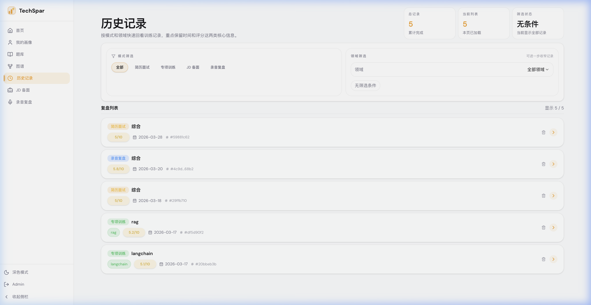

# 训练结果怎么看

每次训练结束后，先别只看一个数字。当前系统里至少有两层分数：

* **单场平均分**：当前这轮训练的结果，通常是 **10 分制**。
* **长期掌握度**：沉淀在画像里的领域趋势，通常是 **100 分制**。

这两个东西不是一回事，不要混着看。

### 先看什么

1. **整体评价**

   先判断这轮到底是知识不够、表达不清，还是答题结构有问题。

2. **逐题复盘**

   这是最有价值的部分。对每一道题，重点看：
   - 你哪里答到了点上
   - 你漏了哪些关键点
   - 改进建议是什么

3. **薄弱点与亮点**

   不要把它们当总结语看过去。它们就是下一轮训练的输入。

4. **参考答案**

   在专项训练等场景里，可以按题查看参考答案。它更适合拿来对照结构和关键点，不适合照背。

### 不同模式下，重点不一样

* **简历模拟面试**：重点看技术深度、项目表达、沟通表达、问题解决。
* **专项强化训练**：重点看逐题得分、遗漏点和参考答案。
* **JD 定向备面**：除了平均分，还要看岗位匹配判断、优先补强项和高风险追问点。
* **录音复盘**：重点看表达问题、内容完整度和真实面试中的失误模式。

### 最后再看“我的画像”

如果某个问题在几轮训练里反复出现，再去 **我的画像** 或 **历史记录** 看它是不是已经形成长期弱项。单场分数只能说明这一次，画像才说明趋势。
